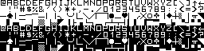
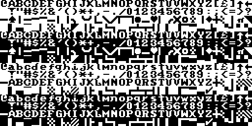
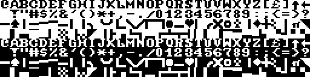
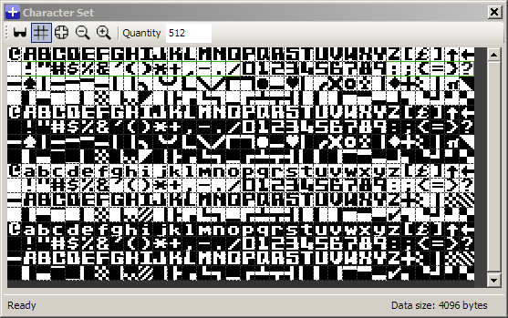
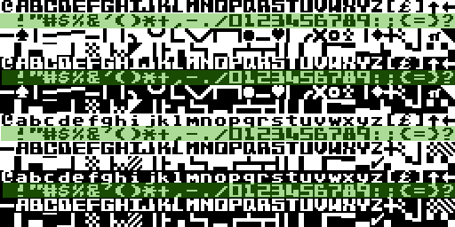

# charcomp

Generate and normalize complete C64 character ROM images from
incomplete charsets

## Synopsis

    $ charcomp incomplete.rom complete.rom
   
## Description

Generates complete C64 character ROM files from possibly incomplete
character sets by copying letters, digits and symbols into the default
C64 character ROM. The relevant character ranges are copied from the
location of their first occurence in the input ROM image and
distributed throughout the output ROM image, generating reversed
characters where required. The graphic characters will not be copied.

The main purpose of this tool is to generate character ROMs suitable
for replacing the original ROM contents. Since most character sets
available on the net are incomplete and often only consist of either
the upper case or mixed case portions and may also lack graphic and/or
punctuation characters, this tool can at least create a starting point
for further editing. Graphic characters are never copied since it is
assumed that a replacement ROM should retain the original graphic
characters so that PETSCII-Art is displayed properly.

## Examples

The charsets used in this examples are available from http://kofler.dot.at/c64/index.html

### Quadro Graf (upper case only)

    $ charcomp quadro_graf.64c quadro_graf.rom

Result:

Since this is an upper-case only charset, the lower case characters
will still need some editing.

### Antik 1 (mixed case only)

    $ charcomp --mixed antik_1.64c antik_1.rom

Result:

Note that the --mixed option is needed to specify that the input
charset is a mixed case charset.

The only symbol that may still need some polishing is the pi symbol.

If you want to separate the upper case and the mixed case portion,
simply specify two output files:

    $ charcomp --mixed antik_1.64c antik-upper.rom antik-mixed.rom

Result:

and

### Assault machine (upper case, no proper symbols)

This input charset does not contain any usable
symbols, so we skip the copying of symbols using the --skip-symbols
option:

    $ charcomp --skip-symbols assault_machine.64c assault-machine.rom

Result:

Now we can edit the charset further:

Only the first occurences of the symbols were edited. In order to
propagate these changes throughout the whole ROM image, we can run the
edited rom image through charcomp again:

    $ charcomp assault-machine-edited.rom assault-machine-edited.rom

Result:

Preview images like these can be generated in PBM format instead of ROM images by 
specifiying the --bitmap option.

## Options

<pre>
Usage: charcomp [&lt;input&gt; [&lt;output&gt;]]
       charcomp [&lt;input&gt; [&lt;output-upper&gt; &lt;output-mixed&gt;

Options:
         -h, --help    : show this help text
         -v, --version : show version information
         -m, --mixed   : specify mixed case input file
         -b, --bitmap  : generate bitmap(s) instead of ROM images

         -L, --skip-letters : skip copying letters
         -D, --skip-digits  : skip copying digits
         -S, --skip-symbols : skip copying symbols
</pre>

## Build & Install from source

Linux, Cygwin & MacOSX:

    $ cd fastboot64
    $ make
    $ make install

Windows (using mingw32):

    $ make CC=i686-pc-mingw32-gcc
   
PREFIX defaults to `/usr/local`. Use DESTDIR for staged installs.

## LICENSE

<pre>
   License GPLv3: GNU GPL version 3 <http://gnu.org/licenses/gpl.html>.
   This is free software: you are free to change and redistribute it.
   There is NO WARRANTY, to the extent permitted by law.
</pre>
